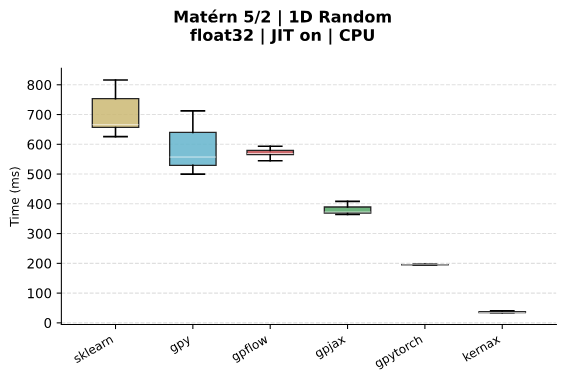

# Should I use kernax?

**tl;dr — if your project is JAX-based, yes.**

Kernax kernels are plain Equinox Modules: they are pytrees, JIT-compiled, and fully compatible with `jax.grad`, `jax.vmap`, and `jax.jit`. If you already work with JAX arrays, there is virtually no overhead to adopting kernax, and you get fast Gram matrix computation on CPU and GPU for free.

## When kernax shines

- **Pure JAX pipelines** — GP regression, Bayesian optimisation, or any model that needs a covariance function and already lives in JAX. Kernels compose, differentiate, and JIT exactly like any other JAX operation.
- **Multi-task / multi-output GPs** — `BatchModule` lets you carry a distinct set of hyperparameters per task inside a single pytree, making batched GP inference straightforward.
- **Custom kernels** — the dual static/instance pattern makes it easy to write a new kernel and have it immediately compatible with JIT, grad, and all wrappers.

## Comparison with other librairies

When jit-compilation is enabled, Kernax computes covariances way faster than any alternative on CPU. 

When a GPU backend is available, Kernax gets even faster. The only library able to keep up with this performance is GPyTorch.

For a complete comparison, check out the [Kernel Arena Repository](https://github.com/SimLej18/KernelArena)

Snapshot from KernelArena (April 4th 2026):

## When the benefit is more limited

If you are using PyTorch, have access to a GPU and want to learn parameters via Torch autograd, using GPyTorch is a better alternative.

Kernax computes dense covariance matrices, but if you want to perform exact GP inference on very large grid (multiple 
thousand of points), this quickly fills a lot of memory. Smarter alternatives have emerged to alleviate the problem, e.g.
in [GPyTorch](https://docs.gpytorch.ai/en/stable/) or [HiGP](https://github.com/huanghua1994/HiGP). 
